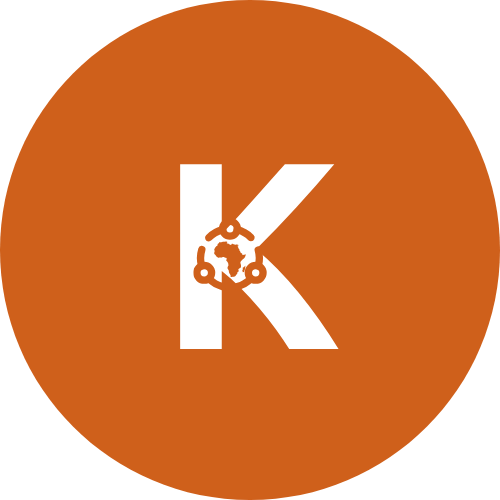

# KOLOCASH ($KOLO) - Whitepaper

## 1. Introduction

KOLOCASH (KOLO) est une monnaie numérique souveraine lancée sur la blockchain Polygon, conçue pour financer des infrastructures et des projets tournés vers l'Afrique, tout en s'inscrivant dans une dynamique de coopération ouverte et équitable à l'échelle mondiale.

Bien plus qu'une cryptomonnaie spéculative, KOLOCASH se veut être un véritable levier de développement économique durable, au service des petites et moyennes entreprises, des associations, des ONG et de toute initiative à fort impact social.

Dans un monde en mutation où les grandes puissances réévaluent leurs priorités, KOLOCASH offre l'opportunité de renforcer l'autonomie économique et de favoriser un développement endogène tout en participant à un écosystème global de coopération.

Ce projet vise ainsi à créer un environnement où les ressources locales sont mobilisées pour répondre aux besoins réels des communautés, dans l'intérêt de la planète et de tous ses habitants.

## 2. Vision

La mission de KOLOCASH est de permettre des transactions fluides et accessibles, de soutenir le financement d'infrastructures locales et de proposer une alternative aux systèmes financiers traditionnels.

Plutôt que de s'inscrire dans une logique exclusive, KOLOCASH se positionne comme un outil de développement économique inclusif, favorisant la coopération et l'intégration entre les acteurs locaux et internationaux.

Le projet entend ainsi contribuer à une croissance résiliente et solidaire, où le développement de l'Afrique profite également à l'ensemble de ses partenaires mondiaux.

## 3. Tokenomics

### 3.1. Caractéristiques du token

- **Nom du Token** : KOLOCASH
- **Symbole** : KOLO
- **Blockchain** : Polygon (ERC-20 sur Polygon)
- **Offre totale** : 100 milliards de KOLO

### 3.2. Levée de fonds initiale

Pour lancer l’écosystème, une levée de fonds initiale sera réalisée par l’émission de 100 000 000 de KOLO proposés au taux de 1 KOLO pour 20 POL (soit environ 0,01 € par token).

Ce premier pas permettra de financer les étapes initiales de développement, d'assurer la liquidité sur les plateformes décentralisées et de poser les bases d'une expansion progressive de l'écosystème.

### 3.3. Répartition des tokens

La répartition des tokens est pensée pour soutenir l’ensemble des dimensions du projet tout en favorisant une implication active de la communauté :

| Catégorie                                         | Pourcentage | Quantité (KOLO) |
| ------------------------------------------------- | ----------- | --------------- |
| Commerce intra-africain & Micro-finance           | 30%         | 30 000 000 000  |
| Infrastructures & Services Financiers             | 25%         | 25 000 000 000  |
| Prévente & Liquidité (incluant la levée initiale) | 25%         | 25 000 000 000  |
| Réserve Communautaire                             | 10%         | 10 000 000 000  |
| Équipe & Développement                            | 5%          | 5 000 000 000   |
| Partenariats                                      | 5%          | 5 000 000 000   |

### 3.3. Taxation des transactions

KOLOCASH intègre un mécanisme de taxe sur les transferts, qui se décompose ainsi :

- 1% des tokens transférés est automatiquement ajouté à la liquidité.
- 1% est brûlé, contribuant ainsi à la réduction progressive de l'offre circulante.
- 1% est alloué aux projets à impact social et économique.

> Note : Contrairement à d'autres mécanismes de redistribution, il n'y a aucune taxe redistribuée aux holders.

## 4. Roadmap

### **Phase 1 : développement & lancement (mois 1-3)**

- [ ] Développement et déploiement du smart contract KOLOCASH sur Polygon.
- [ ] Audit de sécurité complet.
- [ ] Mise en place des canaux de communication (Twitter, Telegram, Discord, Medium) et lancement du site officiel.
- [ ] Réalisation de la prévente initiale de 100 000 000 KOLO
- [ ] Listing et liquidity sur Dex

### **Phase 2 : adoption et croissance (mois 4-6)**

- Listing sur CoinGecko et/ou CoinMarketCap
- Partenariats avec influenceurs et leaders d'opinion pour encourager l’adoption à large échelle.
- Mise en place de la DAO pour une gouvernance communautaire transparente et participative.
- Expansion des cas d’utilisation de KOLOCASH (paiements, microfinance, e-commerce, infrastructures)

### **Phase 3 : stabilisation & cas d'utilisation (mois 6+)**

- Listing sur des exchanges centralisés (CEX)
- Intégration avec des entreprises et institutions financières pour faciliter l'utilisation quotidienne de KOLOCASH.
- Développement d'un mécanisme de stabilisation du prix
- Création d’un fonds d'investissement dédié aux projets à fort impact social et économique en Afrique

## 5. Sécurité et gouvernance

KOLOCASH adoptera un modèle de gouvernance DAO où chaque détenteur pourra voter sur les décisions importantes du projet.

Un **Multi-Sig Wallet** sera mis en place pour la sécurité des fonds et pour assurer la transparence dans la gestion des ressources destinées aux infrastructures et projets économiques.

## 6. Conclusion

KOLOCASH est plus qu'une simple cryptomonnaie ; c'est un outil stratégique qui soutient un développement économique inclusif et durable. En alliant innovation technologique et coopération globale, KOLOCASH permet à l'Afrique et à sa diaspora de mobiliser leurs ressources pour construire un avenir autonome et résilient.

Ce projet incarne l'esprit d'une économie ouverte et collaborative, bénéfique pour la planète et pour tous ses acteurs.

---

📢 **Rejoignez la révolution KOLOCASH dès maintenant !**
